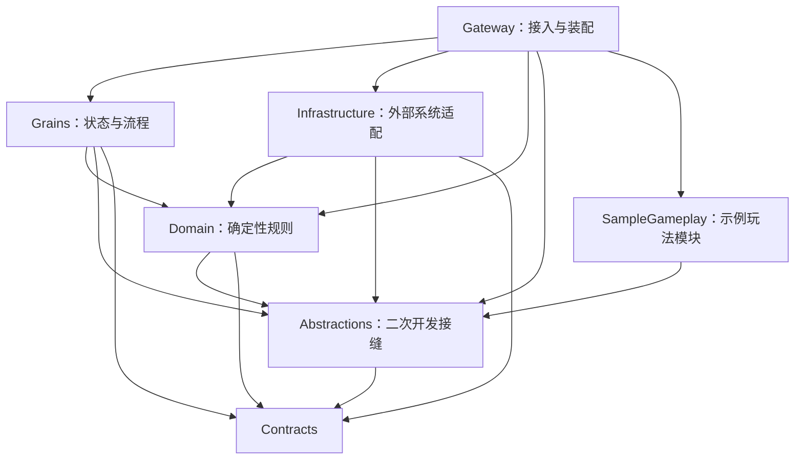

# 架构与扩展原则

本文区分当前实现与演进约束。演进方向见 [ADR 0001](adr/0001-framework-direction.md)，任务状态见 [待办](BACKLOG.md)。

## 当前项目依赖

Contracts 只保留网络 DTO、Grain 接口和序列化内容模型；`GameServer.Abstractions` 承载内容目录、奖励账本、效果和模块组合 Interface。未来有独立客户端包需求时再拆分网络协议与 Grain 契约，并保留类型别名、序列化编号与升级路径。

Gateway 只处理身份、连接、协议与宿主装配；Grains 负责权威状态、业务顺序和恢复；Domain 接受显式输入并返回规则结果；Infrastructure 实现数据库、内容来源和缓存适配。禁止 Domain 引用 EF Core、Redis、HTTP 上下文或 Grain 实现，也禁止 Grains 依赖 Infrastructure 的实现类型。

## 状态所有权与故障语义

| 状态 | 当前所有者 | 约束 |
| --- | --- | --- |
| 登录身份与角色清单 | Identity 数据库 / AccountGrain | 各自负责身份和角色归属；跨两者流程不能假定原子提交 |
| 背包、装备、资源、任务、操作回执 | CharacterGrain | 所有资产变更经权威命令入口；数据库投影不能反向覆盖角色状态 |
| 区域成员与区域位置 | ZoneGrain | 当前角色也保存位置，以持久化移动/切区意图收敛；不可把两次写入视为一次事务 |
| 怪物生命、重生时间与攻击回执 | MonsterGrain | 伤害与回执同次保存，重复攻击返回原结果 |
| 累计奖励流水/投影 | PostgreSQL RewardLedger | 按角色与操作标识去重；累计发奖量不等于当前库存 |
| 内容版本与活动版本 | PostgreSQL / 各节点内容目录 | 数据库存储发布记录；目前在线目录只在导入节点更新，尚缺多节点收敛 |
| 会话与广播订阅 | 尚未实现 | 会话注册与 socket 生命周期需分开；socket 由 Gateway 持有，不能进入持久化 Grain 状态 |

Orleans 默认按请求串行处理 Grain；请求交错与跨 Grain 调用仍需要专门设计，特别是循环等待。变更重入策略前必须记录并验证不变量。[官方请求调度说明](https://learn.microsoft.com/en-us/dotnet/orleans/grains/request-scheduling)

当前采用持久化意图、同次提交操作回执和可重试投递来恢复多步骤流程。超时可能表示提交结果未知；不能因调用失败就更换操作号或假设未执行。恢复尚可能依赖重激活或下一次请求，后台恢复调度、积压告警和人工修复入口需要后续补齐。

Orleans 提供需要显式配置的事务能力。对于交易等新流程，应比较事务参与者范围、存储支持、延迟与故障恢复成本，再决定采用事务还是持久化流程；现有普通 `WriteStateAsync()` 调用不能被描述为跨 Grain ACID 事务。[官方事务说明](https://learn.microsoft.com/en-us/dotnet/orleans/grains/transactions)

## 通用核心与玩法模块

Module（模块）应以小而完整的 Interface（接口）封装状态约束、错误语义和复杂实现。Seam（可替换位置）优先放在已有外部依赖或确实存在不同规则的位置；Adapter（适配器）负责满足该接口。不要为每个类机械增加同名接口和转发类。

- 通用核心：命令身份、会话、状态恢复机制、版本管理、可观察性与宿主集成。
- 可选玩法模块：战斗、任务、社交、经济、副本等；规则可组合，状态始终有明确所有者。
- 基础设施适配器：PostgreSQL、Redis、内容来源、网络推送等；不决定游戏数值和奖励规则。
- 示例游戏：职业、地图、怪物、任务配置以及具体玩法策略，展示框架接入方法。

当前模块通过 `AddGameServer(configuration)` 返回的 `GameServerBuilder` 显式注册。模块声明稳定 ID 和依赖，可贡献依赖注入注册、字符串标识的效果实现、一个类型化内容节和内容校验器；模块图、效果冲突与内容引用在启动或导入阶段失败。运行期 `IGameplayFeatureCatalog` 冻结后只读，`GameContentVersion` 同时携带核心内容和按模块 ID 隔离的强类型内容。

`GameServer.SampleGameplay` 仅引用 Abstractions，并实现 `sample.vampirism`，用于证明新增效果无需修改核心注册表。模块没有自定义启停生命周期；需要宿主生命周期时使用标准 `IHostedService`。当前不支持程序集扫描、热卸载、脚本、自定义实时消息或模块自有 Grain 状态，详见[模块开发指南](guides/modules.md)和 [ADR 0002](adr/0002-compile-time-modules.md)。

## 设计模式使用准则

| 模式 | 适用问题与位置 | 使用限制 |
| --- | --- | --- |
| Strategy | 伤害、效果、掉落或寻路存在真实差异时 | 纯固定公式保留简单函数；接口应隐藏规则复杂度 |
| State Machine | AI、任务、会话、交易等合法状态迁移 | 持久化状态及迁移规则显式可测，避免大量隐含布尔组合 |
| Command + Receipt | 携带命令意图、指纹和已提交结果 | 操作重试语义先于通用分发器；业务失败是否保存回执需明确 |
| Outbox + Idempotent Consumer | 权威状态提交后可靠同步外部账本 | 投递至少一次；需去重、重试、积压指标与保留策略 |
| Saga / Process Manager | 切区、邮件附件、跨角色交易的多步恢复 | 先确定恢复/补偿规则，再提取协调器；补偿本身也需幂等 |
| Adapter / Ports | 隔离真实存储、时钟、内容、推送依赖 | 用替换需求和契约测试证明价值，不包装每个框架调用 |
| CQRS 读写分离 | 排行榜、后台查询、审计读模型 | 明确投影延迟与重建方法；不默认引入事件溯源或消息总线 |

## 时间、实时模拟与扩展

规则计算接收显式时间/随机输入，运行层提供受控来源。进程内间隔优先使用单调时间；持久化 UTC 截止时间用于跨重启恢复，重激活时重建预算并限制最大补偿窗口，不能持久化单调时钟 tick 后跨进程比较。随机奖励必须防止客户端选择操作号影响结果，同时保证重复执行可恢复相同结果。

Timer 的生命周期与 Grain activation 相关；Reminder 可用于较低频的持久化提醒，不能代替高频游戏帧循环。具体调度方式需结合当前 Orleans 版本确认。[官方 Timer 与 Reminder 说明](https://learn.microsoft.com/en-us/dotnet/orleans/grains/timers-and-reminders)

当前每次移动持久化角色和区域、响应构造全区快照并查询怪物，是优先测量的热点。未来优化方向为区域内聚合模拟、AOI、增量推送与明确的检查点；优化前必须定义崩溃时位置允许回退多少，资产操作仍保持严格提交语义。保留当前正确性基线，再根据数据决定是否拆宿主或调整 Grain 粒度。
